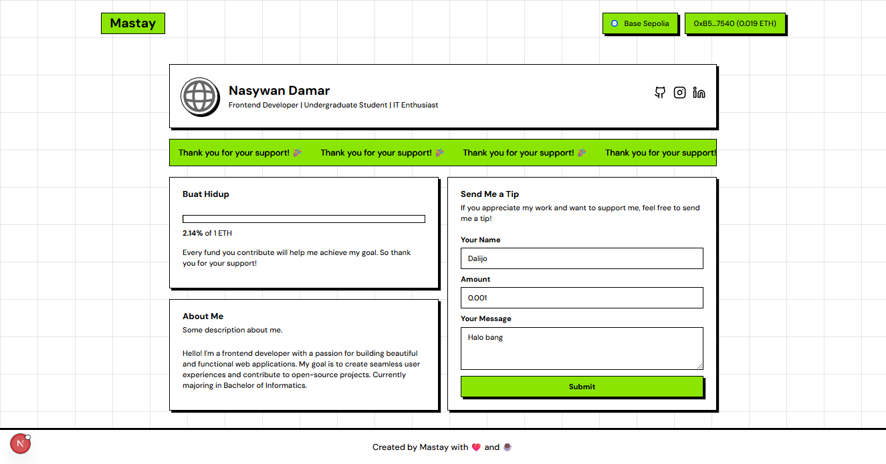

# TipMe - Frontend

This is the frontend for the TipMe decentralized application (DApp), a personal tipping website built with Next.js. It provides a user-friendly interface for interacting with the `TipMe` smart contract on the blockchain.



## Features

-   **Connect Wallet**: Users can connect their Ethereum wallets using RainbowKit.
-   **View Funding Goal**: Displays the current funding goal and progress.
-   **Send Tips**: A simple form to send tips to the contract owner, along with a name and a message.
-   **Responsive Design**: A clean and modern interface that works on all devices.

## Technology Stack

-   **Framework**: [Next.js](https://nextjs.org/) (v15.5.2)
-   **Styling**: [Tailwind CSS](https://tailwindcss.com/) (v4)
-   **UI Components**: [Shadcn UI](https://ui.shadcn.com/) with the [Neo-Brutalism](https://neobrutalism.dev/) theme.
-   **Blockchain Interaction**:
    -   [wagmi](https://wagmi.sh/) (v2.16.9): React Hooks for Ethereum.
    -   [viem](https://viem.sh/) (v2.x): A TypeScript Interface for Ethereum.
    -   [RainbowKit](https://www.rainbowkit.com/) (v2.2.8): A React library for wallet connections.
-   **Package Manager**: [Bun](https://bun.sh/)

## Getting Started

Follow these instructions to get a copy of the project up and running on your local machine.

### Prerequisites

-   [Node.js](https://nodejs.org/)
-   [Bun](https://bun.sh/)

### Installation & Setup

1.  **Clone the repository**.

2.  **Install dependencies**:

    ```bash
    bun install
    ```

3.  **Set up environment variables**:

    Create a `.env.local` file in the `frontend` directory by copying the `.env.example` file.

    ```bash
    cp .env.example .env.local
    ```

    You will need to provide values for the following variables:

    -   `NEXT_PUBLIC_RAINBOWKIT_PROJECT_ID`: Your project ID from [WalletConnect Cloud](https://cloud.walletconnect.com/).
    -   `NEXT_PUBLIC_ALCHEMY_RPC`: Your RPC URL from a provider like [Alchemy](https://www.alchemy.com/).

4.  **Run the development server**:
    ```bash
    bun run dev
    ```

Open [http://localhost:3000](http://localhost:3000) with your browser to see the result.

## Smart Contract

This frontend is designed to interact with the `TipMe` smart contract. The source code for the smart contract can be found in its own repository:

-   **GitHub Repository**: [https://github.com/MastayY/tipme-smart-contract.git](https://github.com/MastayY/tipme-smart-contract.git)

## Deploy on Vercel

The easiest way to deploy your Next.js app is to use the [Vercel Platform](https://vercel.com/new?utm_medium=default-template&filter=next.js&utm_source=create-next-app&utm_campaign=create-next-app-readme) from the creators of Next.js.

Check out our [Next.js deployment documentation](https://nextjs.org/docs/app/building-your-application/deploying) for more details.
